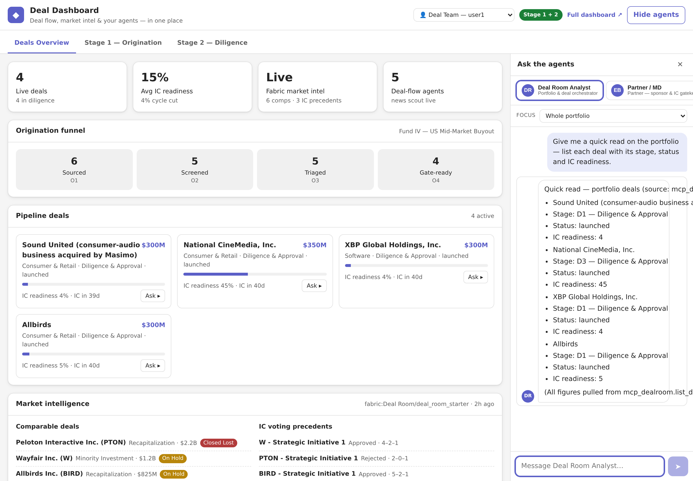
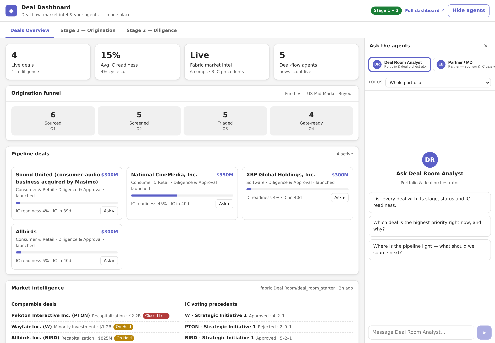
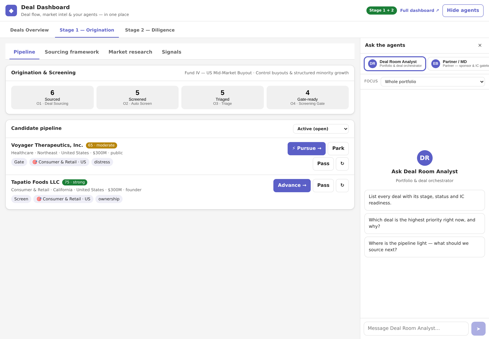
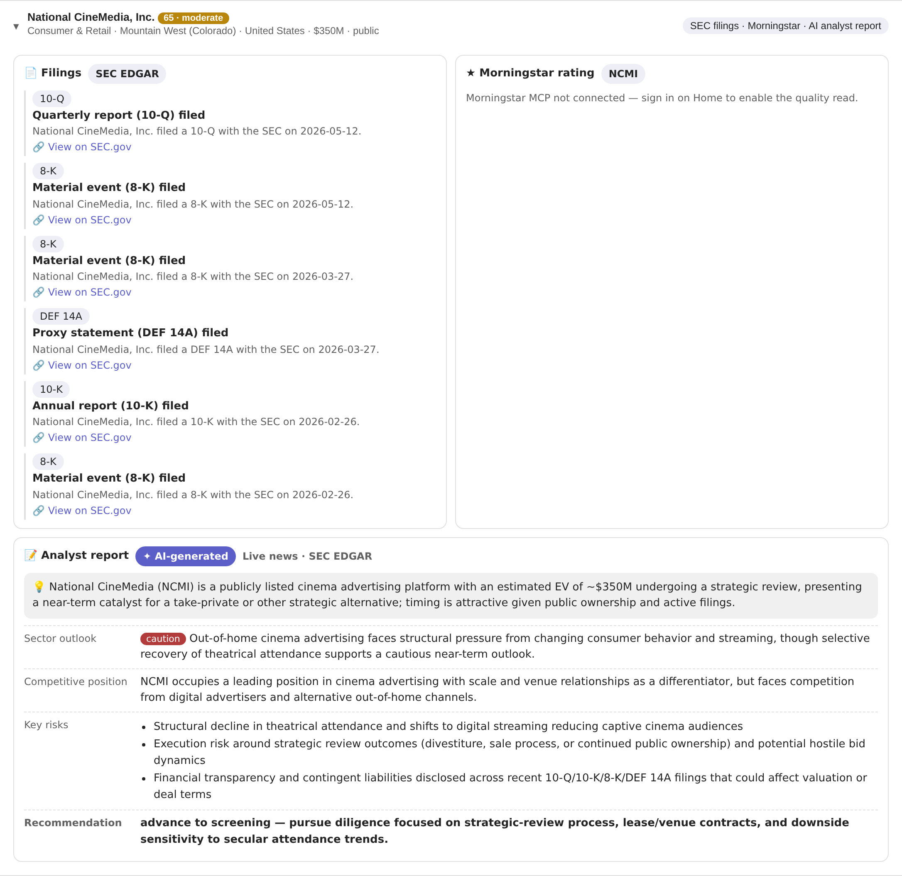
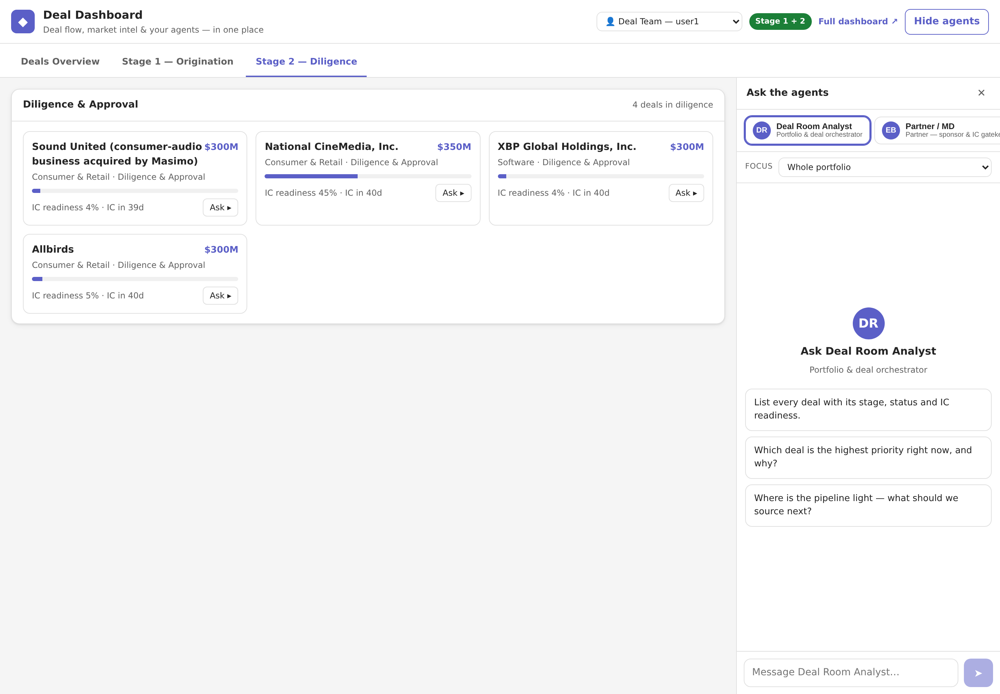
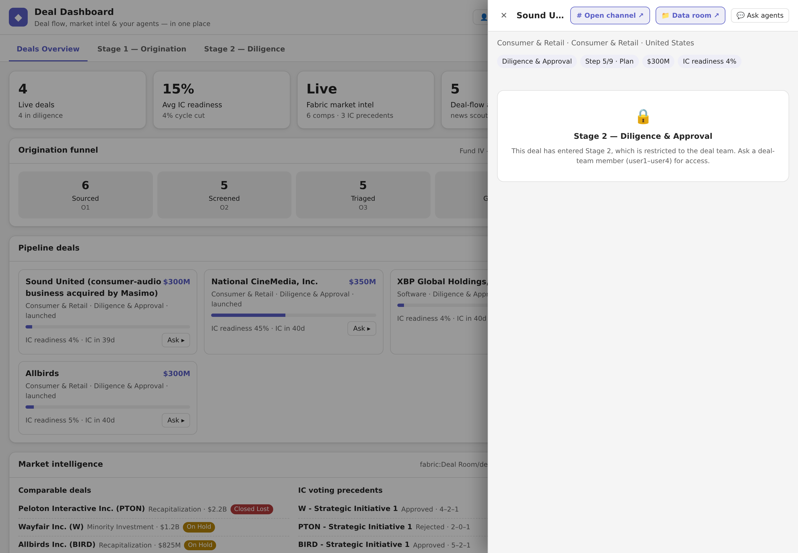

# The Deal Room — on Microsoft Teams

An **AI-native private-equity deal-flow workspace that lives inside Microsoft
Teams**. Deal teams source, screen, and run diligence from the channel they
already work in — **ask an @mentionable agent in natural language**, read a
**channel-native dashboard**, and move deals **stage to stage** — with every
answer **grounded in the live deal record** and **scoped to who is asking**.

Built on **Azure AI Foundry** (live model inference via managed identity), a Teams
**Bot Framework** agent + an **Entra-SSO channel tab**, deployed with a
subscription-agnostic **Bicep** accelerator on **Azure Container Apps**.


<sub>*The Deal Room browser dashboard — the single web-app view. Everything below is the **same live deal record surfaced natively in Microsoft Teams**.*</sub>

> **📘 Solution documentation:** [docs/SOLUTION.md](docs/SOLUTION.md) — architecture, Teams app & channel model, context-aware bot, security/identity, deployment and the operations runbook. Architecture diagram: [docs/dealhub-architecture.drawio](docs/dealhub-architecture.drawio) (Draw.io).

---

## 🚀 Deploy this accelerator

The Deal Room ships as a **self-contained Azure accelerator** — a parameterised
**Bicep wiring harness** you deploy into *your own* tenant and subscription. One
subscription-scoped command provisions everything; you supply only a handful of
parameters and run the Bicep. There are **no manual configuration steps** to get
it running.

### What the platform does
- **Conversational deal agent** (`@Deal Room Assistant`) — @mention it in any deal channel; answers are grounded in the **live** deal record and resolved from the channel itself.
- **Channel-native Teams tab** — dashboard + per-deal workspace over Entra SSO (single data source: the shared `/api`).
- **Identity-aware RBAC** — partner / deal-team / analyst, enforced by *who is asking*.
- **M365 document generation** — per-user **Word** IC memos & **Excel** models on the requester’s own licence: download, **live-refreshable** (Excel web query), or published to the deal’s **SharePoint** data room; plus CSV export.
- **Azure AI Foundry** model inference (managed identity), a **Deal MCP server** (`/mcp`) for hosted/Copilot agents, optional **APIM AI Gateway**, and **Fabric/OneLake** market intelligence.
- **Domain-split resource groups** — `rg-<workload>-{core,ai,data,app,integration,network}-{env}-{loc}` with cross-RG managed-identity RBAC.

### Prerequisites
| # | Requirement | Notes |
|---|---|---|
| 1 | **Azure subscription** with `Owner` (or `Contributor` + `Role Based Access Control Administrator`) | subscription-scoped deploy creates resource groups **and** role assignments |
| 2 | **Azure CLI** ≥ 2.60 + **Bicep** | `az bicep install` |
| 3 | **Region** with AI Foundry + Container Apps | default `swedencentral` (EU residency) |
| 4 | **Entra app registrations** — Teams tab SSO, M365 connector, bot, MCP | created once in *your* tenant; their client IDs are passed as parameters (secrets at deploy time). See [infra/README.md](infra/README.md). **Optional** — leave empty to deploy without the identity features and add them later. |
| 5 | **Container images** | build with `az acr build` after infra, then `az containerapp update --image <acr>/<repo>@sha256:<digest>` (or pass `orchestratorImage` / `teamsImage`) |
| 6 | *(optional)* **Microsoft Fabric** capacity admin | only when `deployFabric = true` |
| 7 | *(optional)* **APIM publisher email** | only when `deployApim = true` |

> **Demo / POC mode:** leave all identity + optional parameters empty and the platform runs on **seeded data** with deterministic agents — **no secrets required**.

### Deploy in one command
```bash
az deployment sub create \
  --location swedencentral \
  --template-file infra/main.bicep \
  --parameters infra/main.sample.bicepparam \
  --parameters teamsTabClientSecret=<secret> botAppPassword=<secret> m365ClientSecret=<secret>
```
Copy [`infra/main.sample.bicepparam`](infra/main.sample.bicepparam) → `main.<env>.bicepparam`, fill the placeholders, and deploy. Full runbook + `what-if` preview: [infra/README.md](infra/README.md).

### Roles — prefab or your own (the wiring harness)
Identity-aware access is a **parameter, not a configuration step**:
- **Prefab roles** — supply Entra **object IDs** (users *or* groups) for `partnerIds`, `dealTeamIds`, `analystIds`. Access is enforced immediately, no code changes.
- **Your own roles** — edit [`app/lib/userPolicy.js`](app/lib/userPolicy.js) (the single policy seam these parameters feed) to define custom roles, personas and permissions.
- **Open mode** — leave the arrays empty; `defaultAgentRole` applies to everyone.

### Customize & extend (agentic skills)
- **Agents** — the deal + persona agents are Foundry agents scaffolded in [`app/scripts/`](app/scripts); the **Deal MCP server** (`/mcp` — `list_deals` / `get_deal` / `search_deals`) is the reusable tool surface for your own hosted agents and Copilot declarative agents.
- **Data** — replace the seeded record with your source of truth behind the single `/api` + Cosmos seam.
- **Surfaces** — the Teams tab reuses the web components; add tabs/cards without touching the backend.

---

## 🤖 Talk to your deals — the conversational agent

**`@Deal Room Assistant`** is a Teams bot you @mention in any deal channel. It
replies in **natural language, grounded in that specific deal** — it works out
*which* deal from the channel itself, so you never restate the company or deal name.

**Ask it the way you'd ask a colleague:**

> 💬 *@Deal Room Assistant, what's the investment thesis here, in three lines?*
> 💬 *@Deal Room Assistant, summarise the latest diligence findings and open risks.*
> 💬 *@Deal Room Assistant, what's the current valuation and the key financials?*
> 💬 *@Deal Room Assistant, how does the retail MD read this opportunity?*
> 💬 *@Deal Room Assistant, what changed on this deal this week?*



<sub>*The Deal Room agent in the Teams tab: asked in plain language, it lists every deal with stage, status and IC readiness — grounded via the live deal tools (`mcp_dealroom.list_deals`).*</sub>

Behind every reply:

- **Channel-grounded** — resolves the deal from a durable channel↔deal map (with a
  company-name fallback), then calls the **live** deal tools (`get_deal`, financials,
  diligence, signals) so answers reflect the current record, not a snapshot.
- **Persona-aware** — one bot routes to the right specialist lens: **analyst**,
  **retail MD**, **supply-chain MD**, **AI MD**, or **partner**, and frames the
  answer from that viewpoint.
- **Identity-gated** — what it will tell you (and do) depends on **who is asking** —
  see [Identity-aware access](#-identity-aware-access-rbac) below.

## 📊 The Teams dashboard (channel tab)

An **Entra-SSO channel tab** renders the deal workspace **natively inside Teams** —
no separate portal, no second sign-in. SSO carries the signed-in user through, so
the dashboard knows *who* is looking.

- **Home command centre** — fund KPIs, the live origination funnel, and the
  deals-in-diligence roster.
- **Per-deal detail** — thesis, financials, diligence, signals and news for the deal
  the channel is scoped to.
- **Inline chat panel** — the same conversational agent, docked beside the data.
- **Proactive Adaptive Cards** — deal events post into the channel as cards with a
  deep link back to the tab, turning the channel into the deal's activity feed.
- **Native Teams theming** — light / dark / high-contrast, with a deal-focused layout
  when the tab is pinned to a single deal channel.



## 🗂️ Stage 1 & Stage 2 — the deal areas

The app *is* the process: two stages joined by the **PURSUE** gate.

### Stage 1 · Origination & Screening — the funnel

| Area | What it does |
|---|---|
| **Deal Sourcing** | A CxO Signals explorer (M365 mail / chats / meetings + Dynamics 365 CRM), a News & Filings desk with an AI **catalyst classifier**, and Analyst Reports thesis context. |
| **Sourcing framework** | Fund Mandate *gates* · Investment Themes *guide* · Screens *rank* — a discover-to-score loop. |
| **Auto Screen → Triage** | Candidates are scored and triaged against the mandate. |
| **Screening Gate** | A decision desk where the MD records **PURSUE** on the gate-ready shortlist, creating a screened deal. |



**Deep-dive analytics on any target.** Expand a candidate for a grounded workup —
**SEC EDGAR filings**, a Morningstar quality read, and an **AI-generated analyst
report** (sector outlook, competitive position, key risks, and a screening
recommendation) — all sourced live and cited:



<sub>*Drilling into National CineMedia (NCMI): live SEC filings alongside an AI-generated analyst report — thesis, sector outlook, competitive position, key risks and a screening recommendation.*</sub>

> ⚡ **PURSUE** provisions the deal's collaboration space — a real **Teams channel**
> and a **SharePoint virtual data room** — via delegated Microsoft Graph, with a
> durable channel↔deal mapping that keeps the agent's context correct as deals scale.

### Stage 2 · Diligence & Approval — the deal hub

| Area | What it does |
|---|---|
| **Launch** | Stands up the diligence workspace — DD checklist, playbook templates, and advisor-paired swimlanes, each node linking out. |
| **Diligence** | The agent works the deal across specialist personas, grounded in the live record and the data room. |
| **Synthesis** | Findings and risks roll up for the investment committee. |
| **Approval & Execution → Archive** | The MD / partner records the decision; the deal is executed and archived. |



## 🔐 Identity-aware access (RBAC)

What the agent returns — and what it will *do* — depends on the **requesting Teams
user's identity**, resolved server-side (a client can never widen its own powers):

| Role | Personas available | Stage-2 deal data | Write actions |
|---|---|---|---|
| **Partner** | all specialists | ✓ | ✓ |
| **Deal team** | analyst + all MDs | ✓ | ✓ |
| **Analyst / member** | analyst only | — (denied) | — (read-only) |

- **Graceful downgrade** — an unauthorised persona request is quietly narrowed to a
  read-only analyst view rather than refused, so the conversation keeps flowing.
- **Stage-2 gating** — diligence / approval data is withheld from read-only roles.
- A **partner** and an **analyst** asking the *same* question get appropriately
  different answers.



<sub>*Viewing as an Analyst, opening a Stage-2 deal returns a lock — "restricted to the deal team" — while a partner or deal-team member sees the full record.*</sub>

## Under the hood — one backend, two surfaces

A single application, a single source of truth, presented through two complementary
tiers that run side by side:

| Tier | Container app | Role |
|---|---|---|
| **Deal Room (web + API + data)** | `ca-dealhub-orch-*` (image `deal-room`) | The full browser SPA **and** the API/data plane — Cosmos DB, the MCP server, Foundry agents, and Microsoft Graph provisioning. **The only tier that holds data.** |
| **Teams interface** | `ca-dealhub-teams-*` (image `dealhub-teams`) | The thin Teams-native front end — the channel tab + the conversational bot. Holds **no data**; every read/write forwards to the orchestrator over `/api`. |

> **Two web apps, by design — not a duplicated version.** The Teams tier proxies all
> data to the one backend (`SHARED_BACKEND_URL`), so there's a single data source and
> nothing to keep in sync. Browser users get the full dashboard; Teams users get a
> channel-native view of the *same* deal record.

**Teams platform capabilities used** — Entra **SSO** (tab per-user context) · **Bot
Framework** conversational bot (single-tenant) with a Teams channel · **channel tabs** ·
**Adaptive Cards** proactive alerts · **deep links** back to the tab · **org app
catalog** distribution & install · per-deal **Teams channels** + **SharePoint** data
rooms · an **MCP** endpoint that lets **M365 Copilot** and hosted agents call the same
grounded deal tools.

### Why it matters

- **Zero context-switching** — Q&A, diligence, and approvals happen in the channel the
  deal team already lives in; adoption doesn't hinge on opening a separate app.
- **Grounded and current** — the bot and tab read the live record through one backend,
  so there's no stale copy or "which version?" ambiguity.
- **Least-privilege by identity** — specialists, Stage-2 data, and write actions are
  scoped to the requester's role.
- **Auditable deal spaces** — each deal gets its own channel + SharePoint data room.
- **Portable accelerator** — the whole experience is parameterised Bicep; a new tenant
  stands it up from app registrations + a handful of parameters.

## Repository layout

```
.
├── app/                    The running application (React + Vite client, Node/Express API)
│   ├── client/             React + TypeScript UI
│   ├── lib/                AI client, agents, in-memory store, Graph webhook
│   ├── data/               Flow, personas, deals, sourcing framework, workspace factory
│   ├── graph/              Microsoft Graph subscription helpers (mailbox signals)
│   ├── docs/               Screenshots
│   └── Dockerfile          Multi-stage build (client → server → runtime)
├── teams-app/              The Teams interface tier (thin front end; holds no data)
│   ├── tab/                Teams-native agent console (React + Vite)
│   ├── server/             SSO/OBO, bot (Bot Framework), backend proxy, Adaptive Cards
│   ├── manifest/           Teams app manifest + build script
│   └── Dockerfile          Multi-stage build (tab → server → runtime)
├── infra/                  Azure infrastructure as code
│   ├── main.bicep          ~45 resources in a single resource group
│   └── main.{dev,test,prod}.bicepparam
└── .github/workflows/      OIDC CI/CD for infra and app
```

## Run locally

```powershell
cd app
npm install
npm run build --prefix client   # build the client once
$env:PORT = 8080
node server.js                  # http://localhost:8080  (demo mode without a Foundry endpoint)
```

The app runs in **demo mode** out of the box (seeded AI responses). Set
`AZURE_OPENAI_ENDPOINT` / `AZURE_OPENAI_DEPLOYMENT` to point at a deployed Foundry
model for live inference.

## Deploy to Azure

The Bicep is **subscription-agnostic** — pick the subscription at deploy time.

```powershell
az group create -n rg-dealroom-dev-swc -l swedencentral
az deployment group create -g rg-dealroom-dev-swc \
    -f infra/main.bicep -p infra/main.dev.bicepparam
# then build & push the app image to the created ACR and point the Container App at it
```

See `infra/README.md` and `app/README.md` for the full details, and
`app/graph/README.md` for the Microsoft Graph mailbox-signals setup.

## Notes

- Authentication is via **managed identity** end to end — there are no secrets in
  this repository.
- Microsoft 365 / Copilot, Dynamics 365, SharePoint and Purview are SaaS /
  tenant-level and are configured via licensing / admin portals, not by Bicep.
