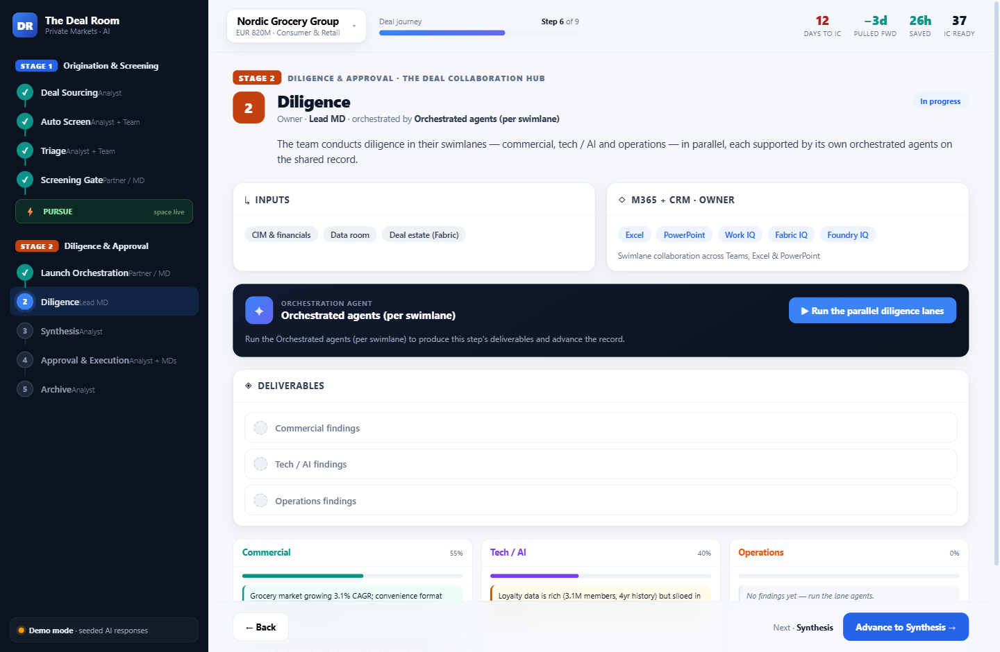
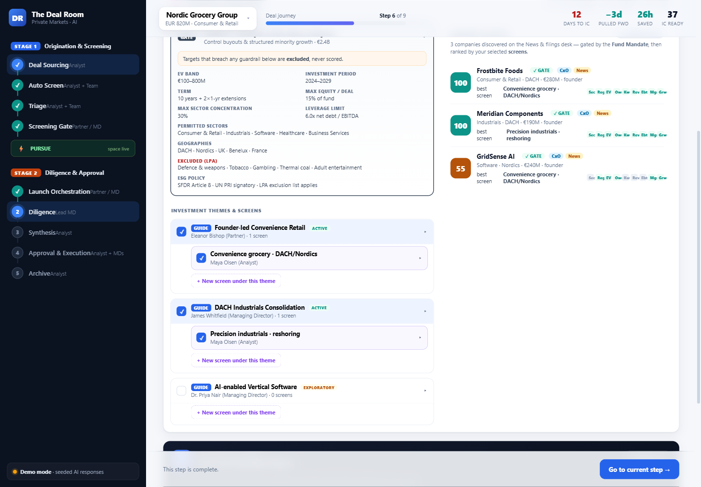
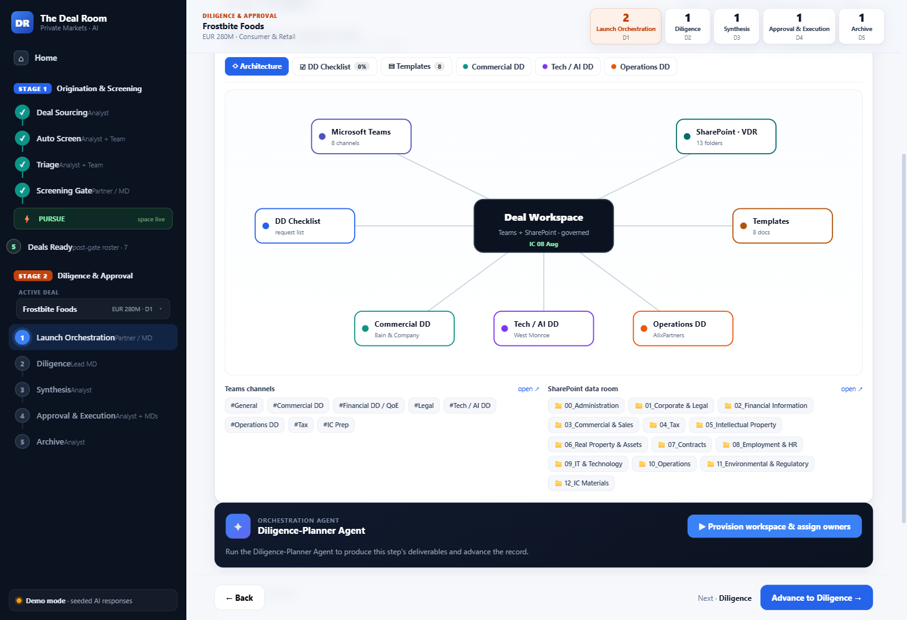

# The Deal Room

An **AI-native private-equity deal-flow workspace** on Azure. The app *is* the
deal process — you move a deal **stage to stage** from the screening funnel into
the Deal Collaboration Hub on Microsoft 365, and at each step an orchestration
agent does the work, grounded in the live deal record.

Built on **Azure AI Foundry** (live model inference via managed identity) with a
subscription-agnostic **Bicep** infrastructure definition, containerized to
**Azure Container Apps**.



## The flow (the canonical process)

Two stages joined by the **PURSUE** gate, nine sequential steps:

```
Stage 1 · Origination & Screening   (the screening funnel)
  O1 Deal Sourcing → O2 Auto Screen → O3 Triage → O4 Screening Gate
        ⚡ PURSUE — Power Automate spins up the deal collaboration space
Stage 2 · Diligence & Approval      (the Deal Collaboration Hub on M365)
  D1 Launch → D2 Diligence → D3 Synthesis → D4 Approval & Execution → D5 Archive
```

## Highlights

- **Home command centre** — fund KPIs, the live origination funnel, and the
  deals-in-diligence roster; the app lands here on refresh.
- **O1 Deal Sourcing depth** — a CxO Signals explorer (M365 mail/chats/meetings +
  Dynamics 365 CRM), a News & Filings sourcing desk with an AI catalyst
  classifier, and Analyst Reports thesis context.
- **Sourcing framework** — Fund Mandate *gates* · Investment Themes *guide* ·
  Screens *rank*, with a discover-to-score loop.
- **Screening Gate** — a decision desk where the MD records **PURSUE** on the
  gate-ready shortlist, creating screened deals.
- **Launch Orchestration** — every deal provisions a real diligence workspace
  with a shapes-and-lines architecture diagram (Teams channels, a SharePoint VDR,
  the DD checklist, playbook templates, and three advisor-paired swimlanes), each
  node linking out.
- **Live Azure AI** — calls the deployed Foundry model via `DefaultAzureCredential`
  (no keys), with a seeded demo-mode fallback so the app is fully usable offline.




## Repository layout

```
.
├── app/                    The running application (React + Vite client, Node/Express API)
│   ├── client/             React + TypeScript UI
│   ├── lib/                AI client, agents, in-memory store, Graph webhook
│   ├── data/               Flow, personas, deals, sourcing framework, workspace factory
│   ├── graph/              Microsoft Graph subscription helpers (mailbox signals)
│   ├── docs/               Screenshots
│   └── Dockerfile          Multi-stage build (client → server → runtime)
├── infra/                  Azure infrastructure as code
│   ├── main.bicep          ~45 resources in a single resource group
│   └── main.{dev,test,prod}.bicepparam
├── .github/workflows/      OIDC CI/CD for infra and app
└── Deal-Room-Target-State-Product-Plan.md
```

## Run locally

```powershell
cd app
npm install
npm run build --prefix client   # build the client once
$env:PORT = 8080
node server.js                  # http://localhost:8080  (demo mode without a Foundry endpoint)
```

The app runs in **demo mode** out of the box (seeded AI responses). Set
`AZURE_OPENAI_ENDPOINT` / `AZURE_OPENAI_DEPLOYMENT` to point at a deployed Foundry
model for live inference.

## Deploy to Azure

The Bicep is **subscription-agnostic** — pick the subscription at deploy time.

```powershell
az group create -n rg-dealroom-dev-swc -l swedencentral
az deployment group create -g rg-dealroom-dev-swc \
    -f infra/main.bicep -p infra/main.dev.bicepparam
# then build & push the app image to the created ACR and point the Container App at it
```

See `infra/README.md` and `app/README.md` for the full details, and
`app/graph/README.md` for the Microsoft Graph mailbox-signals setup.

## Notes

- Authentication is via **managed identity** end to end — there are no secrets in
  this repository.
- Microsoft 365 / Copilot, Dynamics 365, SharePoint and Purview are SaaS /
  tenant-level and are configured via licensing / admin portals, not by Bicep.
