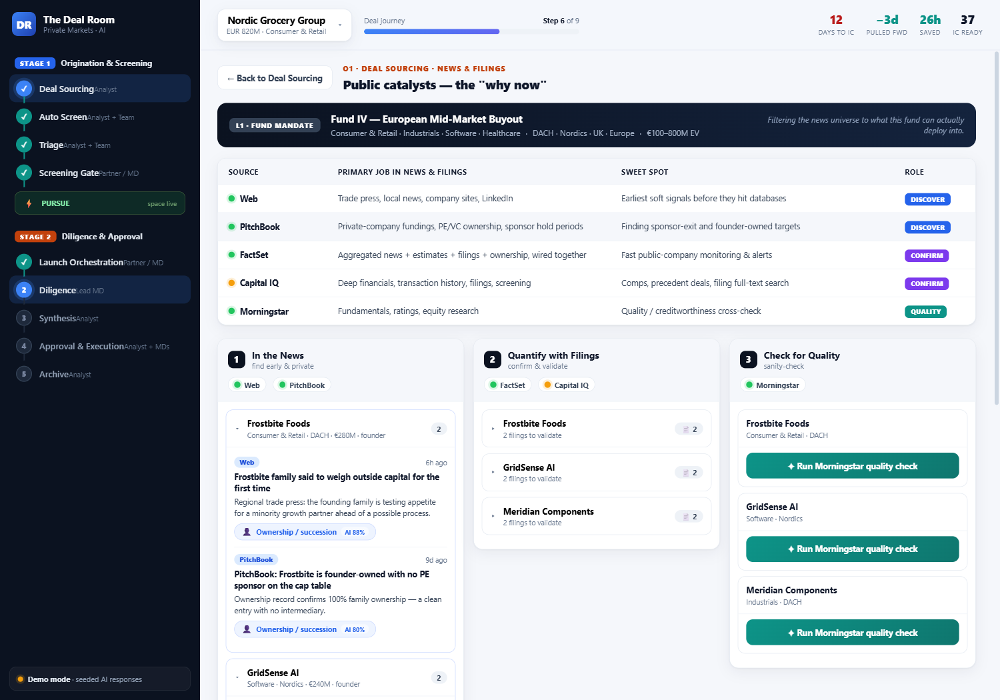
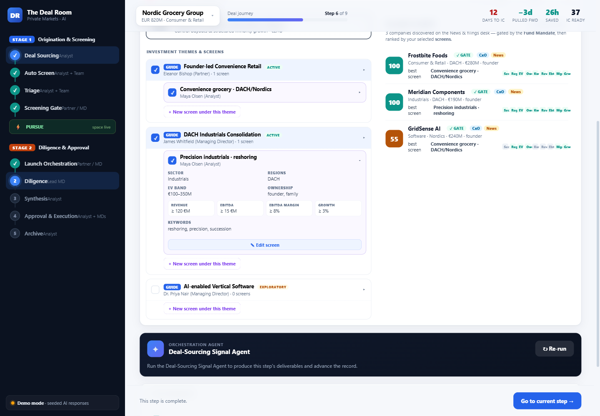

# The Deal Room — Application

An AI-native private-equity deal-flow **workspace** built as a single guided
journey from the screening funnel into the Deal Collaboration Hub on M365. The
app *is* the flow: you move a deal **stage to stage**, and at each step an
orchestration agent does the work. This is the real application that runs in the
orchestrator Container App provisioned by `infra/main.bicep`.


## The flow (Slide 5)

Two stages joined by the **PURSUE** gate, nine sequential steps:

```
Stage 1 · Origination & Screening   (the screening funnel)
  O1 Deal Sourcing → O2 Auto Screen → O3 Triage → O4 Screening Gate
        ⚡ PURSUE — Power Automate spins up the deal collaboration space
Stage 2 · Diligence & Approval      (the Deal Collaboration Hub on M365)
  1 Launch → 2 Diligence → 3 Synthesis → 4 Approval & Execution → 5 Archive
```

## How it works

- **Left = the flow spine.** Both stages, the nine steps, and the PURSUE gate.
  Every step shows done ✓ / current ● / upcoming and its owner. Click to move.
- **Top = the deal bar.** Deal switcher, **Step N of 9** progress, and live
  metrics (days-to-IC, days pulled forward, hours saved, IC readiness).
- **Center = the Station.** One focused workbench per step, always the same
  shape so it is simple to follow:
  *What happens here → Inputs → the orchestration **Agent** with a **Run**
  button → the **Deliverables** it produces → M365 + CRM surfaces & owner*,
  plus a step-specific panel (diligence swimlanes, IC memo, compliance, audit).
- **Advance / Back** drive the journey. Advancing past **O4** triggers the
  **PURSUE** moment — the collaboration space spins up and the deal crosses into
  Stage 2.

Running a step's agent produces a **cited** artifact on the live record, updates
the underlying data (diligence lanes, IC memo, compliance), tallies **hours
saved**, lifts the **readiness** score and pulls the **IC date** forward — making
the time-to-IC value explicit at every step.

## Deal Sourcing (O1) — the signal explorers

The **O1 · Deal Sourcing** station drills into the raw inputs an analyst screens:

- **CxO signals** (button → explorer): the analyst's M365 data in three tabs
  (Emails / Chats / Meeting notes) on the left; on the right, intent signals
  **grouped by company**, each with a **"Check Dynamics 365 CRM"** lookup.
- **News & filings** (button → explorer): a redesigned **sourcing desk**.
  Top: the **L1 fund mandate** the news universe is filtered to, plus a **source
  table** (the five sources with their role — *discover / confirm / quality* —
  and connection status; click a source to expand a details card and **test
  connectivity**). Then a three-column workflow over the discovered companies:
  **① In the News** (Web + PitchBook) — company news findings, each **AI-labeled
  with a catalyst** (click the chip to review the reasoning in a reference table
  and manually reassign it); a **Find more news** button surfaces further targets.
  **② Quantify with Filings** (FactSet + Capital IQ) — click a company to open
  the filings that confirm its catalyst. **③ Check for Quality** (Morningstar) —
  click **Run Morningstar quality check** to get a rating, score, trend and flags.
- **Analyst reports** (button → thesis-context panel): third-party, already-
  interpreted research **attached to each discovered company** (not another
  feed). Expand a company to see its **sector outlook** (market size, growth,
  outlook), **competitive rank** (position, moat, listed/private peers) and
  **sell-side & expert view** (GS/MS notes, expert-network calls). Private
  targets show **read-across** context (listed comps + sector research);
  listed targets like Verde Home show **direct** sell-side coverage.
- **Sourcing framework** (section): the "lens," modelled as the three jobs a PE
  firm's screening rules actually do — **not** one filter narrowed three times:
  - **Fund Mandate · GATE** — the binding LPA constraints (permitted/excluded
    sectors, geographies, hard EV band, concentration & leverage limits, ESG
    policy). Always-on; a target that breaches it is **excluded, never scored**.
  - **Investment Theme · GUIDE** — a partner-sponsored, qualitative hunting
    ground (thesis, why-now, sub-sectors, the value-creation playbook, right to
    win). Directional, not a numeric filter; selecting it toggles its screens.
  - **Screen · RANK** — the analyst's runnable, scored criteria (sector,
    regions, EV band, **financial thresholds**: revenue / EBITDA / margin /
    growth, ownership, keywords). The only tier that produces a score.

  A screen **nests** within its theme and the fund mandate and may only *narrow*
  them — editing one to breach the fund gate (e.g. an EV ceiling above the €800M
  cap, or an excluded sector) is **rejected** with an industry-worded message.
  The **companies discovered on the News & filings desk** are **gated** by the
  fund mandate, then the survivors are **ranked** by the selected screens
  (best-screen match + per-criterion breakdown, gate-pass ✓). A target surfaced
  via **Find more news** immediately appears in the ranked list flagged **✦ new**.
  Discover → gate → rank is one continuous loop.





## Architecture

- **Frontend** — React + TypeScript + Vite (no runtime UI deps), built to static
  assets and served by the API.
- **API** — Node.js / Express (ESM). Serves the client and exposes the deal
  record, persona quick-actions and the Deal Orchestrator chat.
- **AI** — calls the deployed **Azure AI Foundry** `gpt-4o` deployment via the
  OpenAI SDK using **managed identity** (`DefaultAzureCredential`). If no
  endpoint is configured it runs in **demo mode** with realistic seeded output,
  so the app is fully usable offline.

```
app/
  server.js            Express API + static host
  lib/      ai.js      Foundry (Azure OpenAI) client, live-or-demo
            agents.js   step runner — produces cited artifacts per flow step
            scoring.js  sourcing-framework engine — gate + screen scoring + nesting validation
            store.js    in-memory state: deals, journey, signals, framework, scoring
            graph.js    Microsoft Graph webhook receiver (O1 mailbox signals)
  data/     flow.js      the end-to-end flow (Slide 5: stages, 9 steps, gate)
            personas.js  persona / lane metadata
            deals.js     seeded deals
            signals.js   O1 CxO signals (mailbox: emails/chats/meetings + CRM)
            news.js      O1 news & filings desk (tiered sources, catalysts, per-company news/filings/quality + financials)
            research.js  O1 analyst reports — thesis context per company (sector/competitive/sell-side)
            mandates.js  sourcing framework — fund mandate (gate) + themes (guide) + screens (rank)
  client/   React + Vite app — the journey UI
    components/  FlowNav · DealBar · Station · CxoSignals · NewsFilings
                 SourcingFramework · Markdown
  Dockerfile           multi-stage build (client → server → runtime)
```

## Run locally (see it today)

```powershell
cd app
npm install
npm run build:client      # builds the React client
npm start                 # serves on http://localhost:8080
```

Open <http://localhost:8080>. With no Azure variables set it runs in **demo
mode**. To use the live model locally, `az login` and set:

```powershell
$env:AZURE_OPENAI_ENDPOINT = "https://<your-foundry>.cognitiveservices.azure.com/"
$env:AZURE_OPENAI_DEPLOYMENT = "gpt-4o"
npm start
```

## Configuration (environment variables)

| Variable | Purpose | Default |
|----------|---------|---------|
| `PORT` | HTTP port | `8080` |
| `AZURE_OPENAI_ENDPOINT` | Foundry/Azure OpenAI endpoint; unset ⇒ demo mode | — |
| `AZURE_OPENAI_DEPLOYMENT` | Model deployment name | `gpt-4o` |
| `AZURE_OPENAI_API_VERSION` | API version | `2024-10-21` |
| `AZURE_OPENAI_API_KEY` | Optional key (prefer managed identity) | — |
| `AZURE_CLIENT_ID` | User-assigned identity client id for `DefaultAzureCredential` | — |

In Azure these are set automatically on the Container App by `infra/main.bicep`.

## Deploy to Azure

The orchestrator Container App, its ACR, and the Foundry env wiring are created
by `infra/main.bicep`. To ship the app image:

1. Deploy infra (see `../infra/README.md`).
2. Push the image and roll it out — automated by
   `../.github/workflows/deal-room-app.yml`, or manually:

```powershell
$RG = "rg-dealroom-dev-swc"
$ACR = az acr list -g $RG --query "[0].name" -o tsv
$LOGIN = az acr list -g $RG --query "[0].loginServer" -o tsv

# Server-side build (no local Docker needed)
az acr build -r $ACR -t deal-room:latest ./app

# Roll out
az containerapp update -n ca-dealroom-orch-dev-swc -g $RG --image "$LOGIN/deal-room:latest"
```

> The Container App starts on the placeholder image until the first app rollout.
> A full infra stack redeploy resets the image to the placeholder — re-run the
> app workflow (or the commands above) to restore the Deal Room image.

## API surface

| Method | Route | Purpose |
|--------|-------|---------|
| GET | `/api/health` | Liveness probe |
| GET | `/api/config` | AI mode (live/demo), model, region |
| GET | `/api/flow` | The end-to-end deal flow (stages, 9 steps, PURSUE gate) |
| GET | `/api/deals`, `/api/deals/:id` | Deal list + full deal record (with journey position) |
| POST | `/api/deals/:id/steps/:stepKey/run` | Run a step's orchestration agent → cited artifact |
| POST | `/api/deals/:id/advance` | Advance the deal to the next step (crosses the gate) |
| POST | `/api/deals/:id/back` | Move the deal back a step |
| GET | `/api/signals/mailbox`, `/api/signals/companies` | O1 CxO signals (M365 data + grouped signals) |
| GET | `/api/signals/companies/:id/crm` | Dynamics 365 CRM relationship lookup |
| GET | `/api/news/desk` | O1 news & filings desk (L1, tiered sources, catalysts, companies) |
| POST | `/api/news/find-more` | Surface the next discovered company (agent-classified) |
| POST | `/api/news/findings/:id/catalyst` | Manually reassign a finding's catalyst |
| POST | `/api/news/sources/:id/test` | Test a source's connectivity |
| GET | `/api/research` | O1 analyst reports — thesis context attached to each discovered company |
| GET | `/api/framework`, `/api/targets/scored` | Sourcing framework (fund gate · themes · screens) + gated, screen-ranked targets |
| POST | `/api/screens/:id/select` | Select / deselect a screen for ranking |
| POST | `/api/themes/:id/select` | Toggle every screen under a theme |
| PATCH | `/api/screens/:id` | Edit a screen's criteria (validated to nest within its theme + fund gate) |
| POST | `/api/screens` | Create a new screen under a theme (nesting-validated) |
| POST/GET | `/api/graph/notifications`, `/api/graph/signals` | Graph mailbox webhook (see `graph/README.md`) |

> Legacy persona / sourcing / analytics routes remain in the server for
> reference but are no longer used by the journey UI.
