# The Deal Room — Azure Architecture

AI-native private-equity deal sourcing & diligence platform on Azure: **Azure AI Foundry** (persona agents + models) + **Azure Container Apps** (Node/Express API + React SPA + MCP server) + **Azure Cosmos DB** (system of record), grounded on **Microsoft Fabric / OneLake** (market intelligence) and **Azure AI Search** (deal documents + CRM).

- **Subscription:** `ME-MngEnvMCAP336646` (`bf278d8a-49ed-4d34-bae7-3ba55e9c8183`)
- **Primary region:** Sweden Central · **Resource groups:** `rg-dealroom-dev-swc` (app) and `rg-deal-room-data` (data/documents)
- Visual version with official Azure icons: [`deal-room-architecture.html`](./deal-room-architecture.html)

## Diagram

```mermaid
graph TB
  %% ---------------- Users & Channels ----------------
  subgraph USERS["👥 Users & Channels"]
    SPA["Deal Team — Web App (SPA)<br/>Analyst · Partner · Retail / AI / Supply MDs"]
    TEAMS["Microsoft Teams<br/>5 persona agents (1:1, PE Deals channel, per-deal channels)"]
  end

  %% ---------------- Identity & Edge ----------------
  subgraph EDGE["🔐 Identity & Edge"]
    ENTRA["Microsoft Entra ID<br/>MCP token validation · delegated M365 sign-in"]
    MI["Managed Identity<br/>id-dealroom-dev-swc (RBAC)"]
    APIM["API Management<br/>apim-dealroom-dev-7j3ok"]
  end

  %% ---------------- Application Tier ----------------
  subgraph APP["🚀 Application Tier · Container Apps Env (VNet)"]
    CA["Azure Container Apps — Orchestrator<br/>ca-dealroom-orch-dev-swc<br/>API + SPA + MCP (/mcp, /mcp-ro, /mcp-persona)"]
    ACR["Container Registry<br/>acrdealroomdev7j3ok"]
    FUNC["Function App<br/>func-dealroom-events-dev-7j3ok"]
  end

  %% ---------------- AI Tier ----------------
  subgraph AI["🧠 AI Tier · Azure AI Foundry"]
    FND["Azure AI Foundry — proj-dealroom-dev<br/>gpt-5-mini · gpt-5-nano · text-embedding-3-large"]
    AGENTS["Foundry Hosted Agents ×5<br/>analyst · partner · retail-md · ai-md · supply-md"]
    BING["Grounding with Bing<br/>bing-dealroom-dev"]
    DI["AI Document Intelligence<br/>di-dealroom-dev-7j3ok"]
    CS["AI Content Safety<br/>cs-dealroom-dev-7j3ok"]
    SPEECH["AI Speech<br/>spch-dealroom-dev-7j3ok"]
  end

  %% ---------------- Data & Messaging ----------------
  subgraph DATA["🗄️ Data, Messaging & Secrets"]
    COSMOS["Azure Cosmos DB<br/>cosmos-dealroom-dev-7j3ok (deals, agent state)"]
    KV["Key Vault<br/>kv-dealroom-dev-7j3ok"]
    SB["Service Bus<br/>sb-dealroom-dev-7j3ok (deal-events)"]
    EG["Event Grid<br/>evgt-dealroom-dev-7j3ok"]
    STD["Storage — Data / Filings<br/>stdealroomdatadev7j3ok"]
    STF["Storage — Functions<br/>stdealroomfndev7j3ok"]
  end

  %% ---------------- Observability ----------------
  subgraph OBS["📊 Observability"]
    AI_INS["Application Insights<br/>appi-dealroom-dev-swc"]
    LAW["Log Analytics<br/>log-dealroom-dev-swc"]
    MON["Azure Monitor"]
  end

  %% ---------------- Data & Document Platform ----------------
  subgraph PLAT["🟢 Data & Document Platform · rg-deal-room-data"]
    FABRIC["Microsoft Fabric · OneLake<br/>dealroomfabric (market intel + Files/Filings)"]
    AISRCH["Azure AI Search<br/>dealroomaisearch (CIMs + CRM, hybrid)"]
    AOAI["Azure OpenAI (embeddings)<br/>deal-room-data-agent-test (text-embedding-3-small)"]
    STHUB["Storage — Document Source<br/>stdealhubdataaisearch"]
    SRCH2["Azure AI Search — app side<br/>srch-dealroom-dev-7j3ok"]
  end

  %% ---------------- External / M365 ----------------
  subgraph EXT["🌐 External Sources & Microsoft 365"]
    EDGAR["SEC EDGAR<br/>US filings API"]
    M365T["Microsoft 365 — Teams<br/>(Graph, delegated)"]
    M365S["Microsoft 365 — SharePoint<br/>(Graph, delegated)"]
    MCP["Market-data MCP<br/>Morningstar · LSEG · Moody's"]
  end

  %% ---------------- Networking ----------------
  subgraph NET["🕸️ Networking"]
    VNET["Virtual Network<br/>vnet-dealroom-dev-swc"]
    PE["Private Endpoints + Private DNS"]
  end

  %% ---------------- Flows ----------------
  SPA -->|HTTPS| CA
  TEAMS -->|invoke| AGENTS
  AGENTS -->|/mcp-persona · per-persona key| CA
  ENTRA -.->|token validation| CA
  MI -.->|RBAC| CA
  APIM -.->|AI gateway| FND
  ACR -->|image| CA

  CA -->|read/write · RBAC| COSMOS
  CA -->|chat / tool loop| FND
  CA -->|search_documents · get_crm| AISRCH
  CA -->|market intel · archive filings| FABRIC
  CA -->|fetch filings| EDGAR
  CA -->|events| SB
  CA -->|events| EG
  SB --> FUNC
  EG --> FUNC
  CA -->|secrets| KV
  CA -->|Teams / SharePoint| M365T
  CA --> M365S
  CA -.->|optional| MCP
  CA --> STD

  AGENTS -->|news grounding| BING
  AOAI -->|vectorizer| AISRCH
  STHUB -->|ingest| AISRCH
  EDGAR -->|filings| FABRIC

  CA -.-> AI_INS
  FUNC -.-> AI_INS
  AI_INS --> LAW --> MON
  VNET -.-> CA
  PE -.-> COSMOS
  PE -.-> KV
```

## Resource inventory (live deployment)

### `rg-dealroom-dev-swc` — application (Sweden Central)

| Azure product | Resource name | Role in the platform |
|---|---|---|
| Azure Container Apps | `ca-dealroom-orch-dev-swc` | Orchestrator: Node/Express API + React SPA + MCP server (`/mcp`, `/mcp-ro`, `/mcp-persona`) |
| Container Apps Environment | `cae-dealroom-dev-swc` | VNet-integrated hosting environment |
| Azure Container Registry | `acrdealroomdev7j3ok` | App container images (`dealroom-app:vN`) |
| Azure Functions | `func-dealroom-events-dev-7j3ok` | Event-driven deal handlers |
| App Service Plan | `asp-dealroom-dev-swc` | Plan for the Function App |
| Azure AI Foundry (account) | `aif-dealroom-dev-7j3ok` | AI Foundry resource (`Microsoft.CognitiveServices`) |
| Azure AI Foundry (project) | `proj-dealroom-dev` | Project hosting models + agents |
| Model deployments | `gpt-5-mini`, `gpt-5-nano`, `text-embedding-3-large`, `gpt-5-mini-news` | Chat/reasoning + embeddings |
| Foundry hosted agents ×5 | `deal-room-analyst/partner/retail-md/ai-md/supply-md` | Persona agents published to Teams |
| Grounding with Bing | `bing-dealroom-dev` | Live news/web for the sourcing agent |
| Azure AI Document Intelligence | `di-dealroom-dev-7j3ok` | Document/filing extraction |
| Azure AI Content Safety | `cs-dealroom-dev-7j3ok` | Content guardrails |
| Azure AI Speech | `spch-dealroom-dev-7j3ok` | Voice interface (STT/TTS) |
| Azure AI Search | `srch-dealroom-dev-7j3ok` | App-side search service |
| Azure Cosmos DB | `cosmos-dealroom-dev-7j3ok` | System of record (deals, pipeline, artifacts, agent state) |
| Azure Key Vault | `kv-dealroom-dev-7j3ok` | Secrets & keys |
| Azure Service Bus | `sb-dealroom-dev-7j3ok` | `deal-events` queue |
| Azure Event Grid | `evgt-dealroom-dev-7j3ok` | Deal lifecycle event routing |
| Azure Storage | `stdealroomdatadev7j3ok` | SEC filing blobs (`filings` container) |
| Azure Storage | `stdealroomfndev7j3ok` | Function runtime & deploy container |
| Azure API Management | `apim-dealroom-dev-7j3ok` | AI gateway |
| User-Assigned Managed Identity | `id-dealroom-dev-swc` | RBAC to data/AI/secrets/registry |
| Application Insights | `appi-dealroom-dev-swc` | App telemetry |
| Log Analytics Workspace | `log-dealroom-dev-swc` | Central logs |
| Virtual Network | `vnet-dealroom-dev-swc` | Delegated + private-endpoint subnets |
| Private Endpoints / Private DNS | (conditional) | Private access when isolation is enabled |

### `rg-deal-room-data` — data & documents

| Azure product | Resource name | Region | Role in the platform |
|---|---|---|---|
| Microsoft Fabric (capacity) | `dealroomfabric` | West US | OneLake lakehouse: comparable/historical deals, benchmark findings, IC precedents, financials, archived SEC filings |
| Azure AI Search | `dealroomaisearch` | Central US | Hybrid index of CIMs + CRM communications (document intelligence + CRM system of record for the PoC) |
| Azure OpenAI | `deal-room-data-agent-test` | East US | `text-embedding-3-small` integrated vectorizer for the AI Search index |
| Azure Storage | `stdealhubdataaisearch` | Central US | Source documents ingested into the index |

## How it works together

1. **Deal team → Container App** — the React SPA and API are served by the Container App over HTTPS (Entra where required).
2. **Teams → Foundry agents → `/mcp-persona`** — each of the 5 published persona agents calls the app's persona-scoped MCP surface; its key binds it to exactly one persona server-side, so it can only take that persona's authorized actions.
3. **Container App ↔ Cosmos DB** — all deal reads/writes go to Cosmos (managed-identity RBAC, `_etag` optimistic concurrency); Cosmos is the single system of record.
4. **Container App → Azure AI Foundry** — chat/reasoning for the app and the in-app persona tool loop; models are `gpt-5-mini` / `gpt-5-nano` / embeddings.
5. **Container App → Azure AI Search (`dealroomaisearch`)** — `search_documents` and `get_crm` retrieve grounded passages from CIMs + CRM communications (hybrid semantic + vector).
6. **Container App → Microsoft Fabric / OneLake** — reads market intelligence (comps, benchmarks, IC precedents) and archives SEC filings into `Files/Filings`.
7. **Container App → SEC EDGAR** — fetches public filings, then persists to Storage and OneLake.
8. **Container App → Service Bus / Event Grid → Function App** — deal-lifecycle events are queued/routed to event handlers.
9. **Foundry sourcing agent → Grounding with Bing** — live news signals for origination.
10. **AI Search index ← Azure OpenAI** — the index's integrated vectorizer embeds queries/documents with `text-embedding-3-small`.
11. **Container App → Key Vault** (secrets) and **→ Microsoft Graph** (Teams/SharePoint provisioning), both via the managed identity / delegated sign-in.
12. **All services → Application Insights / Log Analytics → Azure Monitor** for telemetry, logs, metrics and alerts.

> Icons in the HTML version are the official Microsoft Azure architecture icons. The AI services (Foundry, Document Intelligence, Content Safety, Speech, embeddings) are all `Microsoft.CognitiveServices` accounts and share that mark; Container Apps, Managed Identity and Microsoft Fabric use on-brand equivalents.
